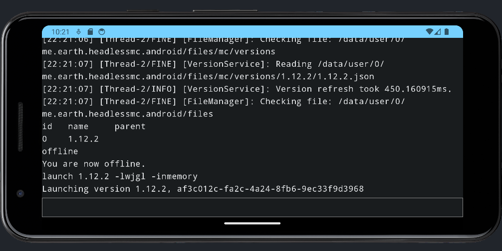

## Loading Jars into the Dalvik VM dynamically

This project showcases how to load a jar into the Dalvik VM at runtime.
It is extremly hacky!
The app packages the [D8 Dexer](https://r8.googlesource.com/r8) tool.
This is originally a command line tool,
for which I actually could not find an official unobfuscated source,
but we can still call its main method.
With this we can turn the jar we want to load into a .dex file at runtime, on the phone.
Then we just need to load it onto a custom PathClassLoader,
which needs to implement `getResourceAsStream` to look up resources in the original jar,
because `getResourceAsStream` works differently from a PathClassLoader and will
probably fail when called from the converted .dex file.
As said, this is very hacky and many classes that are in normal java distributions
are not available inside the Dalvik VM, such as javax.imageio.
You can actually work around this by also packaging the rt.jar,
but at that point you should realize that this is just for fun and not production ready.
All necessary code is inside the `me.earth.headlessmc.android.ResourceDexClassloader` class.

This was originally an attempt to write a
[HeadlessMc](https://github.com/3arthqu4ke/headlessmc) app.
But I realized that running HeadlessMc through Termux is much easier.
You can find instructions on how to do that
[here](https://github.com/3arthqu4ke/headlessmc?tab=readme-ov-file#android).
I might still write a HeadlessMc app at some point, but probably just as a
[Pojav](https://github.com/PojavLauncherTeam/PojavLauncher) fork,
as dealing with the natives is very complicated.

